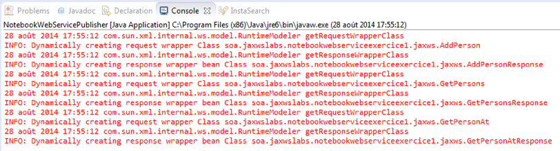

# Exercice 1 (JAX-WS) : développer un service web suivant une approche montante « Bottom/Up »

Le service web de ce premier exercice consiste à fournir des opérations pour la gestion d'un carnet d'adresses simplifié. Une opération pour ajouter une personne, une autre pour récupérer la liste complète et enfin une dernière opération pour récupérer une personne par un nom. Une personne est décrite par un nom (String) et une adresse (String).

## But

* Décrire un service web à partir d'une interface Java.
* Implémenter le service web.
* Publier en local et tester le service web via SOAP-UI.

## Étapes à suivre

* Démarrer l'environnement de développement Eclipse.

* Importer le projet Maven **jaxws-tutorial-exercice1** (**File -> Import -> Maven -> Existing Maven Projects**, choisir le répertoire du projet puis faire **Finish**.

* Depuis le package `fr.mickaelbaron.jaxwstutorialexercice1`, créer une classe qui représentera une personne (**File -> New** puis choisir **Class**). Appeler la classe `Person` et la définir dans le package `fr.mickaelbaron.jaxwstutorialexercice1`.

* Dans la nouvelle classe créée, ajouter un attribut `name` de type `String` et un attribut `address` de type `String`. Définir un constructeur par défaut (important pour JAXB) et un constructeur avec deux paramètres correspondant respectivement à l'initialisation des deux attributs. Générer via l'éditeur les modificateurs et les accesseurs. Pour la génération, exploiter les outils fournis par Eclipse (**Source… -> Generate Getters and Setters** via le menu contextuel de la classe Java).

```java
package fr.mickaelbaron.jaxwstutorialexercice1;

public class Person {

    private String name;

    private String address;

    public Person() {
    }

    public Person(String name, String address) {
        this.name = name;
        this.address = address;
    }

    public String getName() {
        return name;
    }

    public void setName(String name) {
        this.name = name;
    }

    public String getAddress() {
        return address;
    }

    public void setAddress(String address) {
        this.address = address;
    }
}
```

* Définir une interface Java représentant la description du service web (**File -> New** puis choisir **Interface**). Définir comme nom de l'interface `NotebookService` et utiliser le précédent package.

*  Ajouter les méthodes suivantes dans l'interface `NotebookService` :
    * `boolean addPerson(Person p)` : ajouter une nouvelle personne ;
    * `List<Person> getPersons()` : récupérer toutes les personnes ;
    * `Person getPersonAt(String name)` : récupérer une personne par son nom.
*  Ajouter une annotation `@WebService` au niveau de l'interface puis initialiser ces attributs `name` à `NotebookService` et `targetNamespace` à `http://jaxwstutorialexercice1.mickaelbaron.fr`.

```java
package fr.mickaelbaron.jaxwstutorialexercice1;

import java.util.List;
import javax.jws.WebService;

@WebService(name = "NotebookService", targetNamespace="http://jaxwstutorialexercice1.mickaelbaron.fr")
public interface NotebookService {

    boolean addPerson(Person p);

    List<Person> getPersons();

    Person getPersonAt(String name);
}
```

* Construire une nouvelle classe appelée `NotebookServiceImpl` qui implémente l'interface `NotebookService`.

* Ajouter une annotation `@WebService` au niveau de la classe, puis modifier les attributs de l'annotation comme décrit ci-dessous :
    * `endpointInterface = fr.mickaelbaron.jaxwstutorialexercice1.NotebookService`;
    * `serviceName = NotebookService` ;
    * `portName = NotebookPort`.
* Ci-dessous est donné un exemple d'implémentation de la classe `NotebookServiceImpl`. Saisir le code de la classe NotebookServiceImpl. Le corps des méthodes n'est pas très important.

```java
package fr.mickaelbaron.jaxwstutorialexercice1;

import java.util.ArrayList;
import java.util.List;

import javax.jws.WebService;

@WebService(endpointInterface="fr.mickaelbaron.jaxwstutorialexercice1.NotebookService", serviceName="NotebookService", portName="NotebookPort")
public class NotebookServiceImpl implements NotebookService {

    private List<Person> persons = new ArrayList<Person>();

    public NotebookServiceImpl() {
        persons.add(new Person("Mickael Baron", "Migné-Auxances"));
        persons.add(new Person("Sébastien Loeb", "France"));
    }

    @Override
    public boolean addPerson(Person p) {
        System.out.println("addPerson method has been invoked:" + p);

        if (p == null) throw new NullPointerException("Person is null");

        try {
            Thread.sleep(5000);
        } catch (InterruptedException e) {
            e.printStackTrace();
        }

        return persons.add(p);
    }

    @Override
    public List<Person> getPersons() {
        System.out.println("getPersons method has been invoked.");

        return persons;
    }

    @Override
    public Person getPersonAt(String name) {
        System.out.println("getPersonAt method has been invoked: " + name);

        if (name == null || name.isEmpty()) throw new NullPointerException("Name is null.");

        for (Person person : persons) {
            if (name.equals(person.getName())) return person;
        }
        return null;
    }
}
```

* Afin de tester localement ce service web, définir une classe appelée `NotebookWebServicePublisher` à déposer dans le package déjà créé et saisir le code ci-dessous.

```java
public class NotebookWebServicePublisher {
    public static void main(String[] args) throws ClassNotFoundException {
        Endpoint.publish("http://localhost:9991/ws/notebookservice", new NotebookServiceImpl());
    }
}
```

* Exécuter la classe `NotebookWebServicePublisher` pour démarrer votre service web. Vous remarquerez sur la console les messages suivants.



* Afficher la description WSDL de votre service web <http://localhost:9991/ws/notebookservice?wsdl> et comparer le résultat par rapport à ce qui a été défini dans l'interface Java.

Pour tester le comportement du service web, vous utiliserez l'outil SOAP-UI (voir [atelier 1](http://mbaron.developpez.com/tutoriels/soa/soapui-tests-fonctionnels-services-web/ "atelier 1")).

Nous allons nous intéresser à générer le document WSDL à partir de Maven.

* Depuis Eclipse, exécuter la configuration d'exécution appelée *wsgen1 (clean and process-classes)*.

* Depuis la ligne de commande, se placer à la racine du projet et exécuter la ligne de commande suivante :

```
$ mvn clean package
```

* Vérifier depuis le répertoire *target/generated-sources/wsdl* la présence du document WSDL.